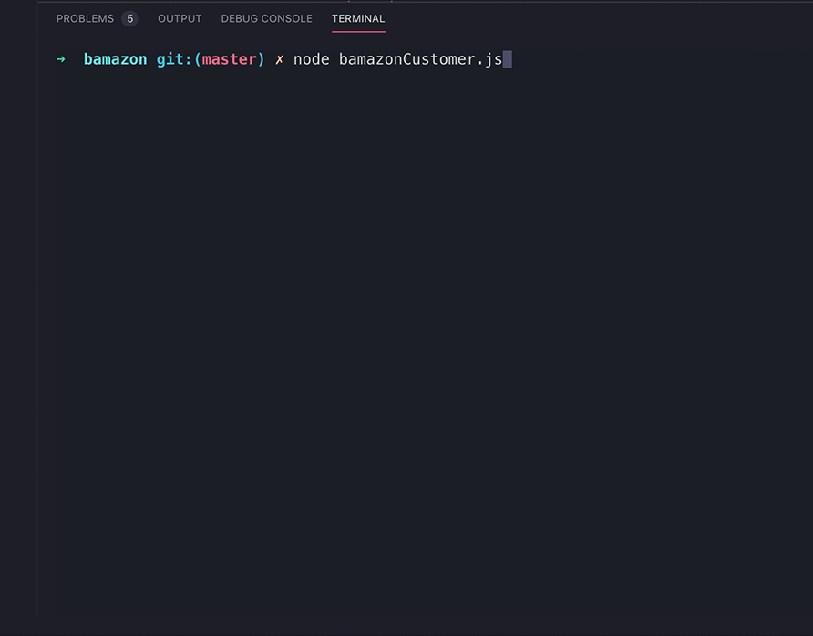
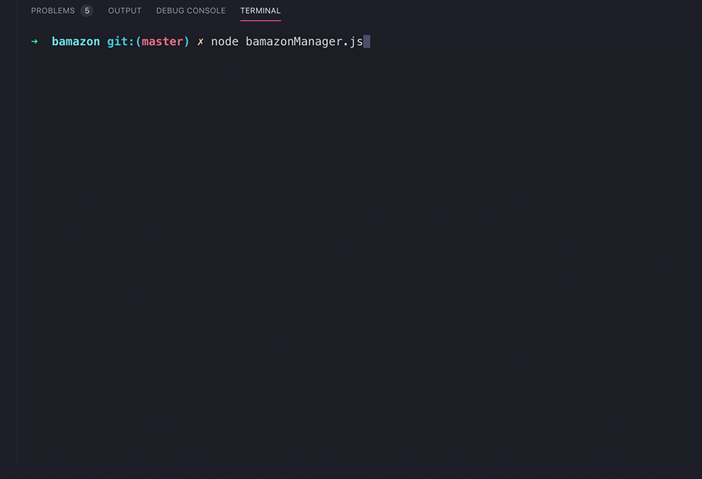

# Bamazon

Bamazon is an Amazon-like storefront run in the terminal. It utilizes a MySQL database, and is run with inquirer functions. The application can be run from the customer side via the file bamazonCustomer.js, or from the manager side via bamazon. manager.js.

### Technologies Used

* JavaScript
* MySQL
* Node.js

### Getting Started

1. Clone the repository
2. NPM i to install mysql and inquirer node packages
3. Create a MySQL database with the bamazon.sql code
4. Enter your MySQL password in bamazonCustomer.js and bamazonManager.js
5. Run application in your terminal

## Bamazon Customer

## Bamazon Manager

